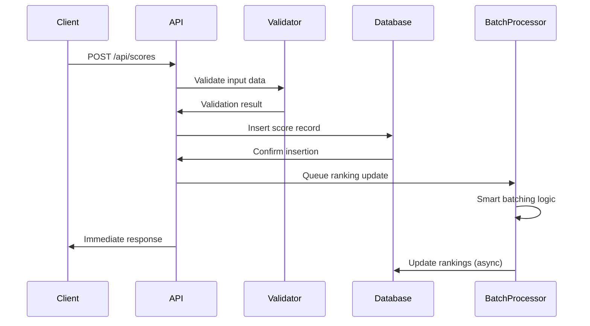
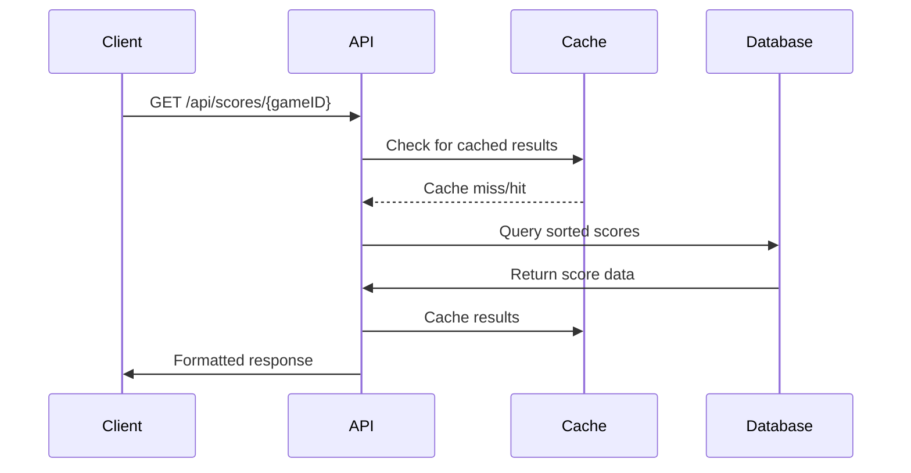

# 🏗️ System Architecture

This document provides a comprehensive overview of the Fouhou Backend architecture, design decisions, and system components.

## 🎯 Architecture Overview

The Fouhou Backend follows a **layered microservice architecture** designed for high performance, scalability, and maintainability.

```
┌─────────────────┐    ┌─────────────────┐    ┌─────────────────┐
│   Game Client   │    │   Web Client    │    │  Mobile App     │
│     (Unity)     │    │  (JavaScript)   │    │   (React)       │
└─────────┬───────┘    └─────────┬───────┘    └─────────┬───────┘
          │                      │                      │
          └──────────────────────┼──────────────────────┘
                                 │
                    ┌─────────────▼─────────────┐
                    │     Load Balancer         │
                    │    (HTTPS/HTTP)          │
                    └─────────────┬─────────────┘
                                 │
                    ┌─────────────▼─────────────┐
                    │   Fouhou Backend API     │
                    │   (Express.js/Node.js)   │
                    └─────────────┬─────────────┘
                                 │
                    ┌─────────────▼─────────────┐
                    │    Batch Processor       │
                    │  (Intelligent Ranking)   │
                    └─────────────┬─────────────┘
                                 │
                    ┌─────────────▼─────────────┐
                    │      OrientDB           │
                    │   (Graph Database)       │
                    └─────────────────────────────┘
```

## 🧩 Core Components

### 1. **API Layer** (`app.js`)
- **Framework**: Express.js
- **Purpose**: Handle HTTP requests, routing, middleware
- **Features**:
  - CORS support for cross-origin requests
  - Request logging and monitoring
  - Error handling and validation
  - Graceful shutdown mechanisms
  - SSL/HTTPS support for production

### 2. **Route Handlers** (`api/scoreAPI.js`)
- **Purpose**: Business logic and endpoint implementations
- **Responsibilities**:
  - Input validation and sanitization
  - Database operations coordination
  - Response formatting
  - Error handling and logging

### 3. **Database Layer** (`Database/databaseClass.js`)
- **Database**: OrientDB (Graph Database)
- **Purpose**: Data persistence and retrieval
- **Features**:
  - Connection pooling and management
  - Query optimization
  - Transaction support
  - Schema management

### 4. **Batch Processing System**
- **Purpose**: Intelligent ranking calculations
- **Features**:
  - Smart batching algorithms
  - Load-based processing
  - Asynchronous ranking updates
  - Performance optimization

## 🔄 Request Flow Architecture

### Standard Score Submission Flow



### Leaderboard Retrieval Flow



## ⚡ Batch Processing Architecture

### Intelligent Batching System

The batch processing system is the heart of the performance optimization:

```javascript
class RankingBatchProcessor {
  constructor() {
    this.config = {
      maxBatchSize: 10,         // Maximum scores per batch
      batchTimeoutMs: 2000,     // Maximum wait time
      cooldownMs: 500,          // Cooldown between updates
      highLoadThreshold: 50     // High-load mode threshold
    };
  }
}
```

### Batching Strategy

1. **Score Collection**: Incoming scores are collected per game
2. **Smart Triggering**: Batches are triggered by:
   - Time threshold (2 seconds)
   - Size threshold (10 scores)
   - Load threshold (50+ pending)
3. **Asynchronous Processing**: Rankings update without blocking API responses
4. **Cooldown Management**: Prevents excessive database operations

## 🗄️ Database Architecture

### Schema Design

```sql
-- GameScores Class (OrientDB)
CREATE CLASS GameScores EXTENDS V

-- Properties
CREATE PROPERTY GameScores.GameID STRING
CREATE PROPERTY GameScores.UserID STRING  
CREATE PROPERTY GameScores.Username STRING
CREATE PROPERTY GameScores.Score DOUBLE
CREATE PROPERTY GameScores.Ranking INTEGER
CREATE PROPERTY GameScores.Timestamp DATETIME

-- Indexes for Performance
CREATE INDEX GameScores.GameID_Score ON GameScores (GameID, Score) NOTUNIQUE
CREATE INDEX GameScores.UserID ON GameScores (UserID) NOTUNIQUE
CREATE INDEX GameScores.GameID_UserID ON GameScores (GameID, UserID) UNIQUE
```

### Indexing Strategy

| Index | Purpose | Type |
|-------|---------|------|
| `GameID_Score` | Leaderboard queries | Composite |
| `UserID` | User score lookups | Single |
| `GameID_UserID` | Unique constraint | Unique Composite |

## 🔒 Security Architecture

### Input Validation Layer
```javascript
const validateScoreData = (req, res, next) => {
  const { gameID, score, userID, username } = req.body;
  
  // Validation rules:
  // - gameID: required string
  // - score: required number
  // - userID: required string
  // - username: required string
  
  // SQL injection prevention
  // XSS protection
  // Data type validation
};
```

### Security Features
- **Input Sanitization**: All inputs validated and sanitized
- **CORS Configuration**: Controlled cross-origin access
- **Error Masking**: Sensitive error details hidden in production
- **SSL/TLS Support**: Encrypted communication in production
- **Rate Limiting**: Prevents abuse and DoS attacks

## 📊 Performance Architecture

### Key Performance Features

1. **Asynchronous Processing**
   - Non-blocking score submissions
   - Background ranking calculations
   - Promise-based database operations

2. **Intelligent Caching**
   - Query result caching
   - Connection pooling
   - Memory-efficient operations

3. **Load Management**
   - Adaptive batch sizing
   - High-load mode detection
   - Resource usage optimization

4. **Database Optimization**
   - Strategic indexing
   - Query optimization
   - Connection management

## 🔄 Scalability Considerations

### Horizontal Scaling
- **Load Balancer Ready**: Multiple instance support
- **Stateless Design**: No server-side sessions
- **Database Clustering**: OrientDB cluster support
- **Container Ready**: Docker-compatible architecture

### Vertical Scaling
- **Memory Optimization**: Efficient data structures
- **CPU Optimization**: Optimized algorithms
- **I/O Optimization**: Connection pooling

## 🔧 Configuration Architecture

### Environment-Based Configuration
```javascript
const DB_CONFIG = {
  host: process.env.DB_HOST || 'localhost',
  port: process.env.DB_PORT || 2424,
  username: process.env.DB_USERNAME || 'root',
  password: process.env.DB_PASSWORD || 'password',
  database: process.env.DB_NAME || 'gamedb'
};
```

### Configuration Layers
1. **Environment Variables**: Runtime configuration
2. **Default Values**: Fallback configuration
3. **Production Overrides**: Environment-specific settings

## 🔍 Monitoring Architecture

### Built-in Monitoring
- **Health Endpoints**: `/api/health`, `/api/test-db`
- **Request Logging**: Comprehensive request tracking
- **Error Tracking**: Detailed error logging
- **Performance Metrics**: Response time tracking

### Monitoring Data Points
- API response times
- Database connection status
- Batch processor status
- Error rates and types
- Request volumes

## 🚀 Deployment Architecture

### Production Setup
```
┌─────────────────┐
│  Load Balancer  │
│   (Nginx/HAProxy) │
└─────────┬───────┘
          │
┌─────────▼───────┐
│   API Servers   │
│  (Node.js PM2)  │
└─────────┬───────┘
          │
┌─────────▼───────┐
│   OrientDB      │
│   (Cluster)     │
└─────────────────┘
```

### Key Deployment Features
- **SSL/TLS Termination**: Secure communication
- **Process Management**: PM2 for production
- **Graceful Shutdown**: Clean process termination
- **Health Monitoring**: Continuous health checks

## 📚 Related Documentation

- [Database Schema](Database-Schema.md) - Detailed database design
- [Batch Processing](Batch-Processing.md) - Deep dive into batching system
- [Performance Optimization](Performance.md) - Performance tuning guide
- [Production Deployment](Production-Deployment.md) - Deployment guide

---

**🏗️ Architecture Status**: Optimized | **📈 Scalability**: High | **🔒 Security**: Enterprise-Grade